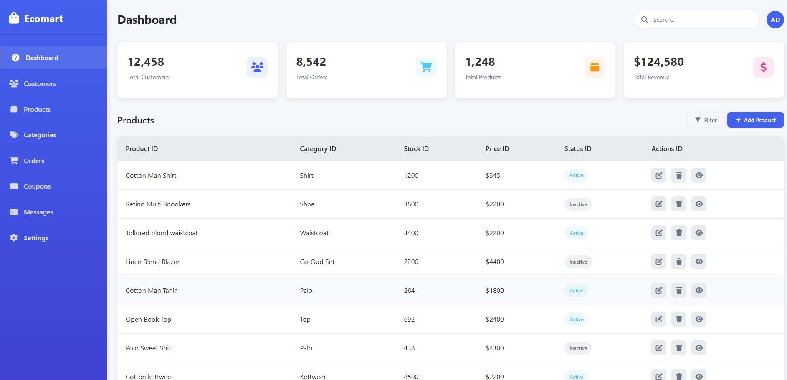

# EcoMart Dashboard

EcoMart is an eco-friendly marketplace dashboard that helps users track and manage sustainable products and services. This web-based application provides an intuitive interface for monitoring environmental impact and managing eco-conscious transactions.

## Features

- **Product Management**: Track sustainable and eco-friendly products
- **Real-time Analytics**: Monitor sales and environmental impact metrics
- **User Interface**: Clean, responsive design with modern aesthetics
- **Environmental Impact**: Track carbon footprint reduction and sustainability metrics

## Technology Stack

- HTML5
- CSS3
- JavaScript (Vanilla JS)

## Project Structure

```
├── images/       # Screenshots and images
├── index.html    # Main entry point
├── styles.css    # Stylesheet for the dashboard
├── script.js     # Core functionality and interactivity
└── README.md     # Project documentation
```

## Screenshots



To add a screenshot:
1. Take a screenshot of your dashboard
2. Save it in the `images` directory
3. Add the screenshot to this README using the following markdown syntax:
   ```markdown
   
   ```

## Getting Started

To view the dashboard, simply open `index.html` in a modern web browser.

## Contributing

We welcome contributions that enhance the dashboard's functionality while maintaining its eco-friendly focus.

## License

This project is open source and available under the MIT License.
